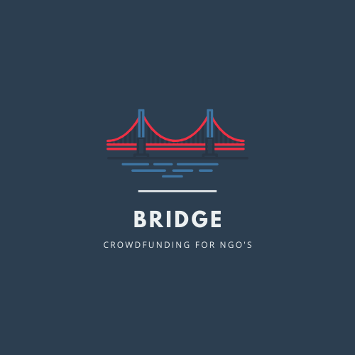

<p align="center">
	
</p>

## Bridge

The Crowdfuding platform for NGO's. Contribute to what matters the most.

## Getting Started

* Install Flutter
* Install VSCode/Android Studio
* Clone this repo
* Run ```pub get``` to get all the dependencies.

## Join the mailing list 

Join the slack channel [here](https://join.slack.com/t/thekitefoundation/shared_invite/zt-f285idyr-UiTMN5Ms8vSUHHa9DbPfBA).

## Contributing

Read more about th contribution guidelines in the Contributing.md File
